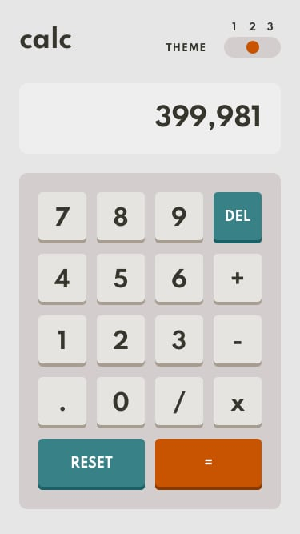

# Frontend Mentor - Calculator App

se realizó challenge de frontend mentor siguiendo diseño de guia provisto por la pagina

[LINK SITIO](https://facundoangel.github.io/FEM/calculadora/)

## TECNOLOGÍAS

-html

-css

-sass

-javascript

-jquery

## DISEÑO DEL CHALLENGE

Vista Escritorio

Vista Movil

