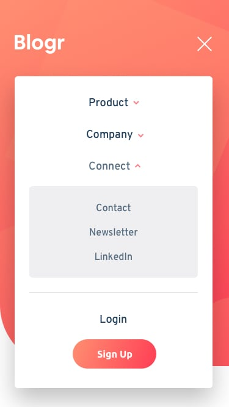

# Frontend Mentor - Blogr landing page

se realizó challenge de frontend mentor siguiendo diseño de guia provisto por la pagina

[LINK SITIO](https://https://facundoangel.github.io/FEM/landing-page-1/)

## TECNOLOGÍAS

-html 

-css

-sass

-javascript 

-jquery

## DISEÑO DEL CHALLENGE

**Vista Escritorio**

**Vista Mobil**

**Vista Menu de Mobil**

**Vista con interacción de usuario**

